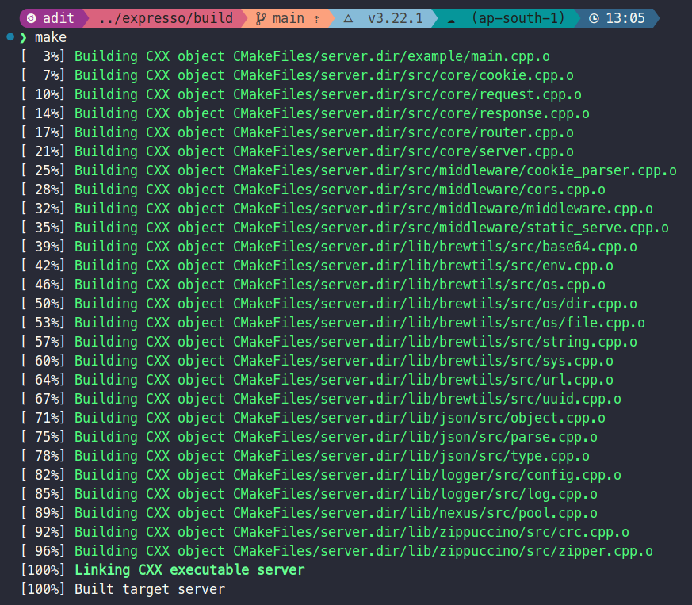
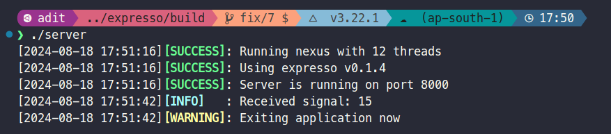

# Expresso ☕️

A C++ backend framework designed for web applications. A few features include:

- Simple and easy to use API ✨
- Built-in HTTP server 🌐
- Out of the box multi-threading support 🧵
- Expandable custom middleware 🧩

It is pretty straightforward and if you are familiar with the Express.js framework, you will feel right at home, as the API is very similar, which is my goal? 🎯

## Installation 🚀

0. Make sure you have the gnu g++ compiler installed on your system. You can install it by running the following command:

```bash
sudo apt-get install g++ build-essential
```

1. Clone the repository:

```bash
git clone --recurse-submodules git@github.com:coding-cpp/expresso.git
```

2. Make a `.env` file in the root directory of the project and add the environment variables present in the [`.env.sample`](./.env.sample) file in it.

3. Build the project:

```bash
cd expresso
mkdir build && cd build
cmake ..
make
```



4. Run the server:

```bash
./server
```



## Example

You can find an example of how to use the framework in the [`example`](./example/) directory.

## Docker 🐳

You can also run the server using Docker. Make sure you have Docker installed on your system.

1. Build the Docker image:

```bash
docker build -t expresso .
```

2. Run the Docker container:

```bash
docker run -p 8000:8000 -e PORT=8000 expresso
```

Alternatively, you can use the pre-built Docker image from Docker Hub (supports both amd64 and arm64 architectures):

```bash
docker run -p 8000:8000 -e PORT=8000 jadit19/expresso:0.1.2
```

If you prefer to use Docker Compose, you can use the following `docker-compose.yml` file:

```yaml
name: expresso
version: '3'
services:
  expresso:
    image: jadit19/expresso:0.1.2
    container_name: expresso
    restart: unless-stopped
    environment:
      - PORT=8000
```

## Contributing 🤝

If you would like to contribute to the project, feel free to fork the repository and submit a pull request. I am always open to new ideas and suggestions. 🚀

## Bugs and Issues

If you encounter any bugs or issues, feel free to open an issue on the repository. This is a work in progress and since I am the only one working on it, that too in my spare time, I might not have the time to fix it right away, but I will try my best to get to it as soon as possible. 🐛🔧
